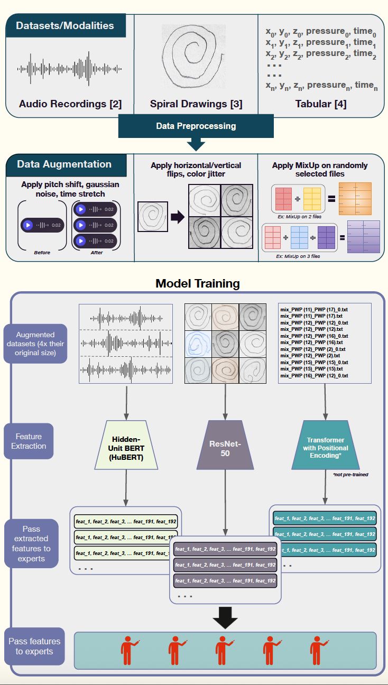

# Project Overview

Parkinson's Disease (PD) is a prevalent neurodegenerative disorder affecting approximately  (percent) of adults nationwide, with its main symptoms being tremor, bradykinesia, etc. 
In addition to the condition lacking a cure, it is also difficult to diagnose during its early progression, commonly confused with similar parkinsonian disorders up into its final stages. 

Among the many forms of diagnosis, this project aims to further leverage non-invasive modalities - **spiral drawings and audio recordings** - to detect PD, as compared to similar CV methods using MRI and PET scans.
However, the relevant datasets available comprise very small sample sizes, complicating data variability and generalizability.
To combat the issue(s) of limited datasets, misalignment between modalities, and missing patient information, I demonstrate the usefulness of a multimodal classification model using a pipeline comprising dataset-dependent feature extraction and a dataset-aware Mixture of Experts (MoE) model. 
The architecture boasts its robustness by being able to make a prediction given any combination of modalities, and generalizability

The key goal is to answer the following research questions:

- Can machine-learning be leveraged to accurately diagnose PD using only non-invasive data collection methods?
- Can data augmentation and Mixture of Experts address the issues of limited sample sizes and disjoint datasets?
- How can I define optimally performing pipelines tailored to each modality? Can our model achieve good performance even if one modality is lacking?

# Pipeline Overview
This study focuses on the latter methods and attempts to expand upon previous deep-learning feature extraction utilizing spiral drawings and audio recordings. I do so by devising a model architecture with a Mixture of Experts (MoE) layer that is compatible with multiple datasets of distinct modalities. I also draw upon and review previous literature's model training pipelines comprising data preprocessing, data augmentation, and feature extraction per modality. Finally, I compare our model's performance on all input combinations with the current state-of-the-art. Our methodology allows versatility with model inputs and creates a well-rounded, comprehensive model for PD classification.

It is recommended to be familiarized with the datasets in [Data Provenance and Availability](#data-provenance-and-availability) before reviewing the methodology.

Detailed information about each step, as well as lines of thought, can be found below. 

## Data Preprocessing
After their respective preprocessing, each dataset is then split into 70/30 train/test groups. I use a set random seed for reproducability.

### Tabular
For simplicity, I filtered each participant's file to only include data from Static Spiral Test (SST). X, Y, Z, time, and pressure columns are extracted from each sample. With the context of at-home recordings in mind, I discard Grip Angle data as common stylus devices do not record tilt/stylus orientation. However, I may experiment with using it in the future if considering use in professional, clinical environments where high-end technology is available. Note: I do notice that some images from the healthy patients had a run-off line, but I chose to use them as is.

### Image
The original spiral images are already centered. Additionally, each image is converted to greyscale, resized to 224x224, and normalized. 

### Audio
Each audio file is resampled to 16KHz for the later feature extraction step, and amplitude is normalized between [-1.0, 1.0]

## Data Augmentation
Data augmentation is applied to address class imbalances and increase the size of our training data. Because our datasets are so limited, this step is crucial to increasing the diversity and generalizability of the data. All augmented data is included in the _augmented_data_ directory, and modality-specific steps are detailed below.

### Tabular
After splitting, our training group consists of 20 PD and 12 control samples.  To address class imbalance, I apply oversampling to the control group during data augmentation to achieve a balanced distribution.

**MixUp** augmentation is performed on randomly selected files of the same class [See original paper here](https://arxiv.org/pdf/1710.09412). MixUp combines data from two different samples using this equation:
**<pre> x̃ = λxᵢ + (1 − λ)xⱼ  </pre>**

where **$\tilde{x}$** is the resulting mixed data, **$(x_i, y_i)$** and **$(x_j , y_j)$** are data of two samples from our training group, and **$\lambda$** is a randomly sampled float within [0, 1]. Due to our class constrained approach, the **$y_i$** and **$y_j$** values remain the same.

MixUp is applied to 2 randomly selected, with replacement, samples of the same class. Because each participant's file varied in number of timestamps - in some cases by more than 2000, I only accepted the pair if the timestamp difference was <300 and padded the shorter sample before mixing. I also generated an attention mask to pass into our transformer encoder for later feature extraction. The same pair could be chosen multiple times, but each instance used a newly generated **$\lambda$** value.

I repeat this until the original training set is balanced doubled. The process is then rerun with a augmented sample from the **MixUp_2_files** directory and an original file, essentially mixing 3 files. Finally, it is run on the **MixUp_3_files** directory. This results in a training dataset more than 4x its original size, with 160 samples with an even class distribution. 

### Image
MixUp was also applied to the image data, with each point representing a coordinate or pixel of the image rather than a timestamp.I were initially skeptical of applying MixUp to the image data as this resulted in two spirals in one image, so I opted to also include commonly used geometric transforms, such as resize, color jitter, stretch, and horizontal and vertical flipping. Interestingly, MixUp and geometric augmentations performed very similarly (around 92-93\%) accuracy when used to double the training set, with MixUp taking the edge. Therefore, I speculate that MixUp may be a viable method despite the single-line nature of our spiral images. 

For each image in the training set, I applied 1, 2, then 3 augmentations and saved the augmented copies. No class balancing is required. After experimenting with different augmentations available and number of variations to produce, I found that generating 3 variations of the original image with 1, 2, and 3 randomly chosen augmentations from color jitter, horizontal flip, and vertical flip yielded the best results. After augmentation, our training dataset is 4x its original size, with 244 samples in total.

### Audio
For each recording in the training set, I randomly selected 3 of 4 augmentations (Add Gaussian Noise, Pitch Shift, Time Stretch, Gain) and applied each separately, saving the 3 augmented versions. I do not apply multiple augmentations due to the nature of the recordings, hoping to preserve any subtle tremors captured. After augmentation, our training dataset is 4x its original size, with 256 samples in total.

## Feature Extraction
This step describes the process during which the original data is compressed into a smaller dimensionality by an encoder, representing its most meaningful 'features' so that our final classification model can learn more effectively. I use a combination of pre- and post-trained models depending on the modality, but all data is encoded to 192 latent (extracted) features. 

### Tabular
Due to the sequential nature of the timestamped data points, a positionally-encoded Transformer was deployed. During training, I found that loss stopped decreasing after around 14 epochs at around 0.16, so the Transformer's weights at that point were saved. This loss value is highly sub-optimal. I believe that this method would have done substantially better had it been trained for many more epochs, but computation expenses and time must be considered as constraints. 

### Image
The pretrained ResNet-50 model was used in a previous work and showed very impressive performance, so I mirrored their methodology - for continuity and lack of need for revision. No further finetuning was performed on the spiral images. 

### Audio
3 pretrained audio-processing models - wav2vec 2.0, HuBERT, and WavLM - were each tested No further finetuning was performed on the spiral images. 

## Mixture of Experts with Routing Layer

A brief diagram of the MoE architecture is shown above. Our inspiration was drawn from [DAMEX](). DAMEX uses hard-routing, in which each expert is assigned a unique modality, with effectively  one expert specializing in each modality. I also tried soft-routing, in which inputs can be given to any expert regardless of modality. 

## Model Evaluation

## Discussion and Future Works
Being the only modality in which a post-trained encoder was used, our results demonstrate the upsides of importing 

Our main priority is first improving accuracy of our current pipeline by modifying each modality's processing, as necessary. I aim to push all variations of multimodal models, receiving 2, then all 3 modalities as input, to comparable performnce as seen in previous literature. In the futher future, I also want to implement DeepSeekMoEs to merge our current approach with LLMs.

# Manuscript Status
The paper detailing the project's background, previous works, methodology, experimental results, etc. is being drafted. For a full list of references and/or questions, please contact the author at oliau@usc.edu.

# Data Provenance and Availability
All datasets used were accessed from public databases. 

The [tabular dataset](https://archive.ics.uci.edu/dataset/358/improved+spiral+test+using+digitized+graphics+tablet+for+monitoring+parkinson+s+disease.) was collected by the Department of Neurology in Cerrahpasa Faculty of Medicine at Istanbul University \cite{tabulardataset}. For 25 PD and 15 control patients, three variations of a spiral drawing task were presented, and the following was recorded on a Wacom Pen tablet:
1. x coordinate
2. y coordinate
3. z coordinate
4. Pressure on the screen with digital pen (0-1023 scale)
5. Grip angle of the individuals'
6. System time in ms that sample is recorded
7. Test ID (0: Static Spiral Test (SST), 1: Dynamic Spiral Test (DST), 2: Stability Test on Certain Point (STCP)

The [image dataset](https://www.kaggle.com/datasets/kmader/parkinsons-drawings/) comprises handwriting samples of what is essentially the Static Spiral Test (SST) task in the tabular dataset, only represented in drawing form. The source has pre-divided them into train/test folders, but I created our own from the entire dataset of 51 PD and 51 control patients.  

The [audio dataset](https://figshare.com/articles/dataset/Voice_Samples_for_Patients_with_Parkinson_s_Disease_and_Healthy_Controls/23849127) includes voice recordings in .wav format with participant age and sex. For 40 PD and 41 control participants, each sample records a prolonged enunciation of the vowel /a/. They were collected using participants' telephones.  

# Quickstart Guide
## Requirements (Subject to Change)
audiomentations       0.42.0
Brotli                1.1.0
colorama              0.4.6
conda-libmamba-solver 25.3.0
h2                    4.2.0
nn                    0.1.1
opencv-python         4.12.0.88
pip-autoremove        0.10.0
PySocks               1.7.1
scikit-image          0.25.2
seaborn               0.13.2
torchaudio            2.7.1
torchvision           0.22.1
transformers          4.54.0

# Running the Code
Currently, the code is very unrefined and very segmented. A master program will be written once all pipelines are finalized. The MoE model can be run directly as all input data is included. 
However, if needed for replication purposes, each modality's steps are organized into separate files with names corresponding to the step executed. 

# Acknowledgements
This work was conucted as part of the University of Wyoming's HUMANS MOVE: NSF REU Site, under the mentorship of Dr. Shivanand Sheshappanavar.

